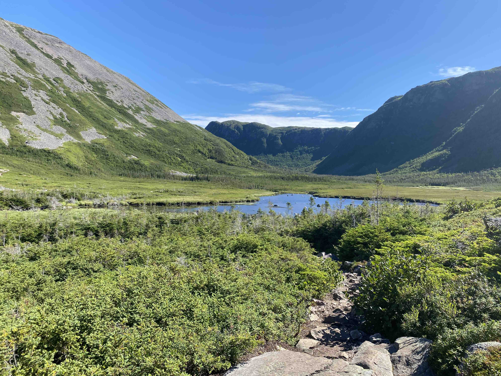
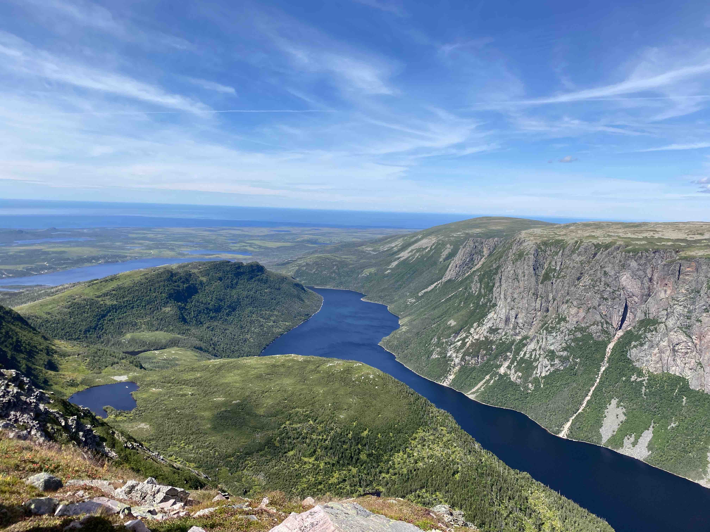
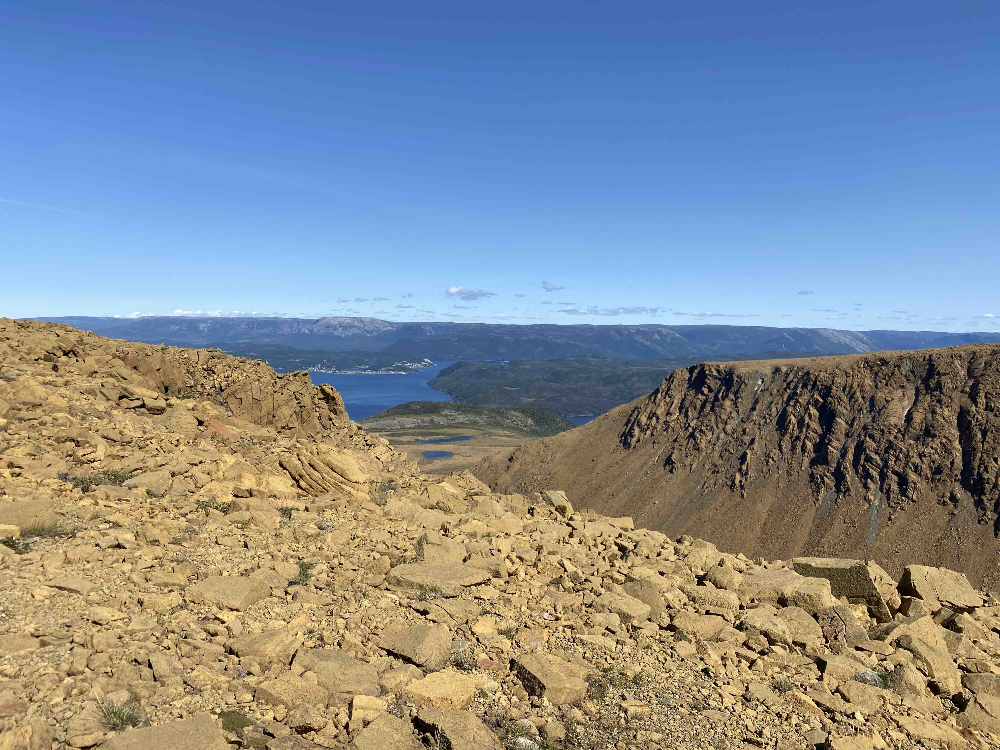
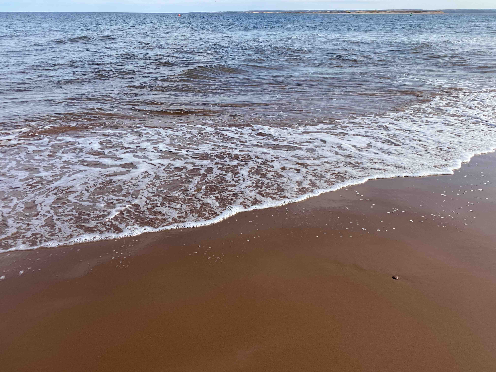
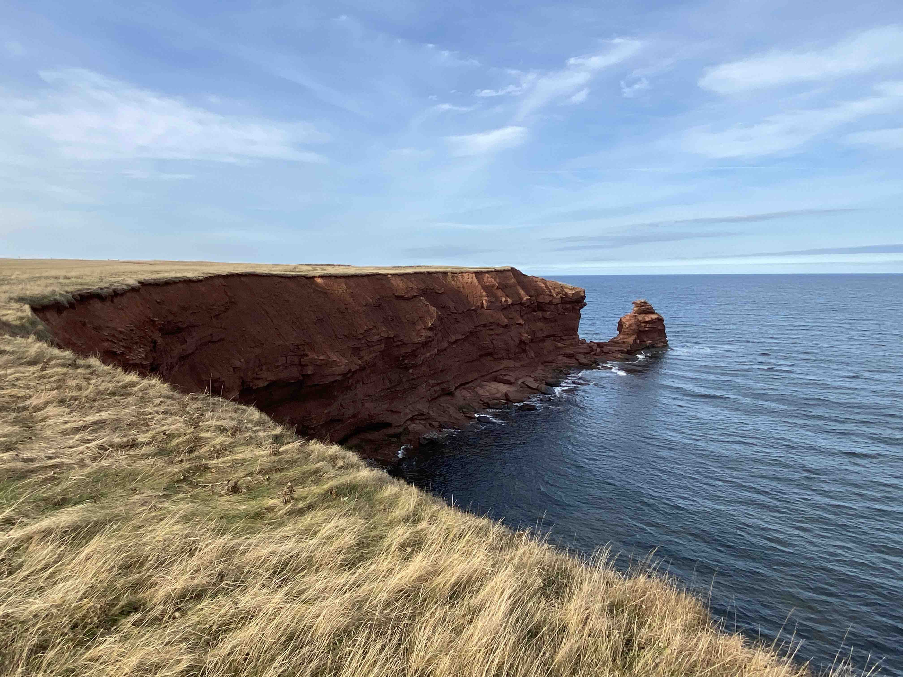

```{r setup, include=FALSE}
knitr::opts_chunk$set(echo = FALSE)
```
## Biography

I'm originally from a small town in Newfoundland, called [Harbour Grace](https://www.hrgrace.ca/). Growing up I loved math and science, so when I had the chance I decided to pursue those subjects in university. For my BSc (Joint Hons) in Applied Math and Physics, I completed research in numerical methods for adaptive mesh generation. This research was conducted under the supervision of Dr. Ronald Haynes. Next, I completed my MSc in Math under the supervision of Dr. Hari Kunduri. This research focused on theoretical black holes and their geometry. My BEd in Intermediate/Secondary Education was completed as I finished my MSc. This included a teaching internship at Prince of Wales Collegiate in St. John's, NL.

In my spare time I enjoy spending time outside. This includes relaxing beach trips or day long hiking expeditions. Growing up in Newfoundland gives one ample opportunity to explore nature and I'm lucky to continue doing so on beautiful Prince Edward Island. I live in Charlottetown with my wife and our five pets (2 dogs and 3 cats).

  

  







